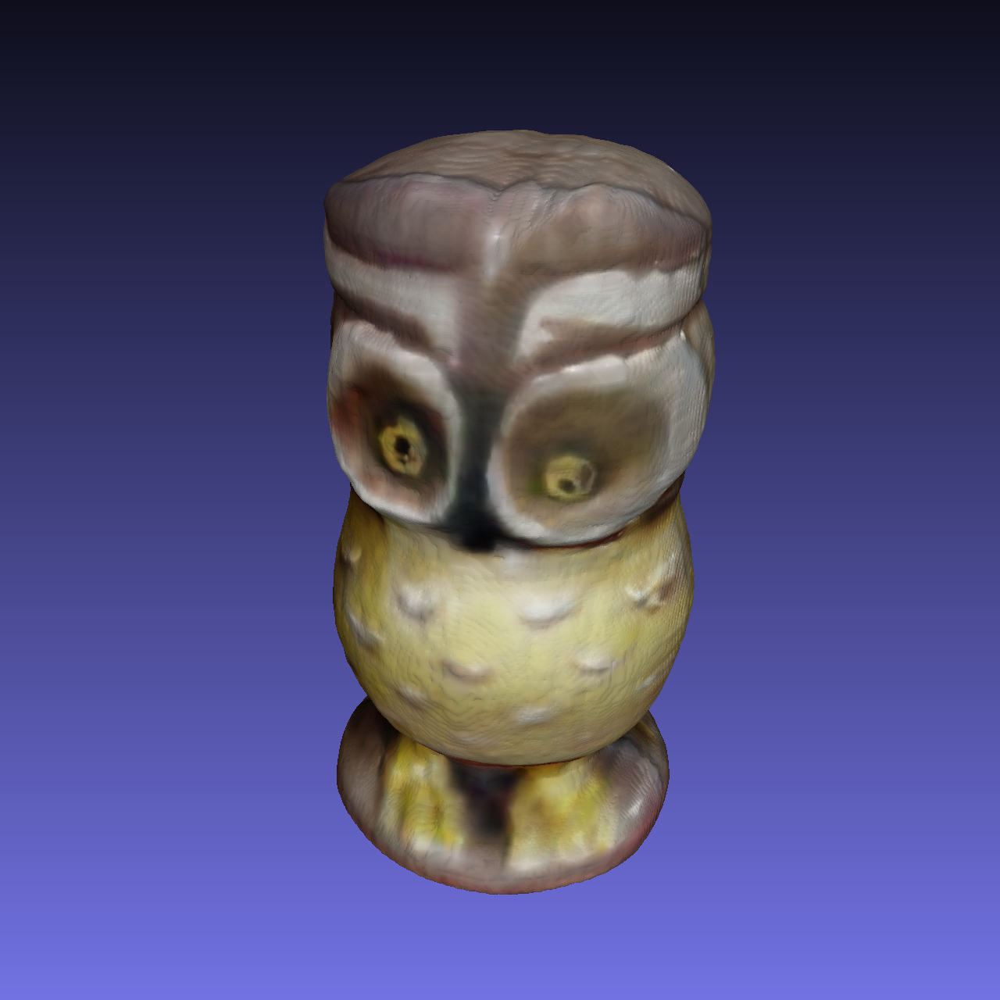
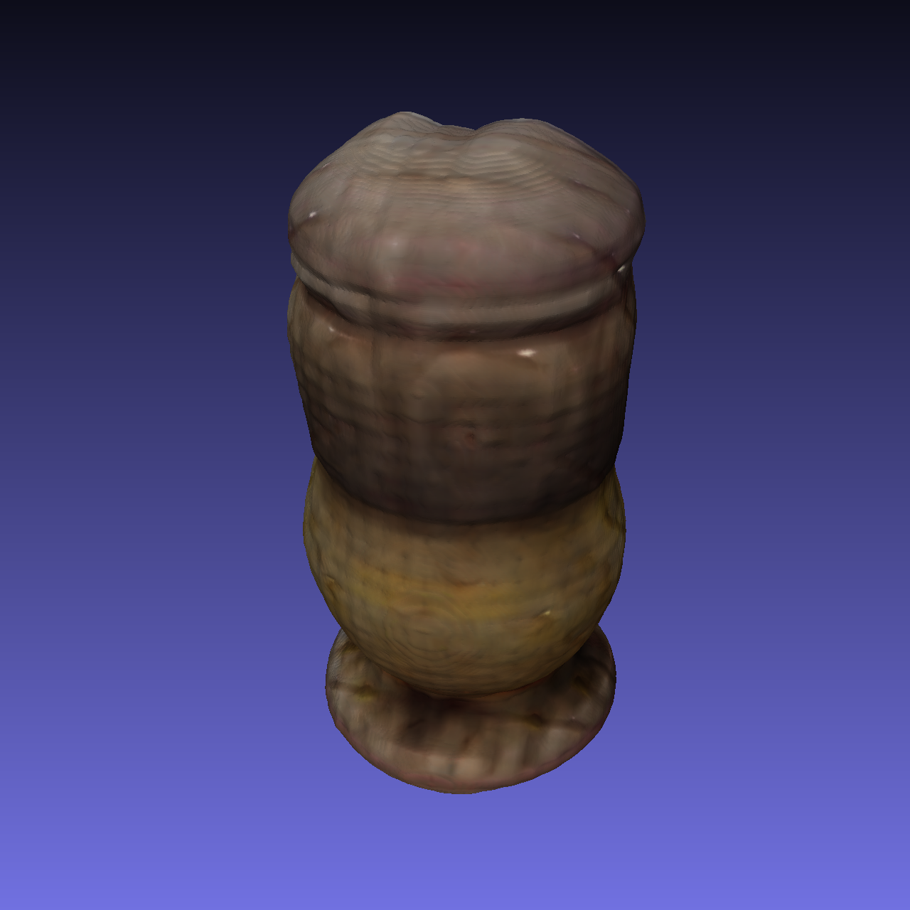
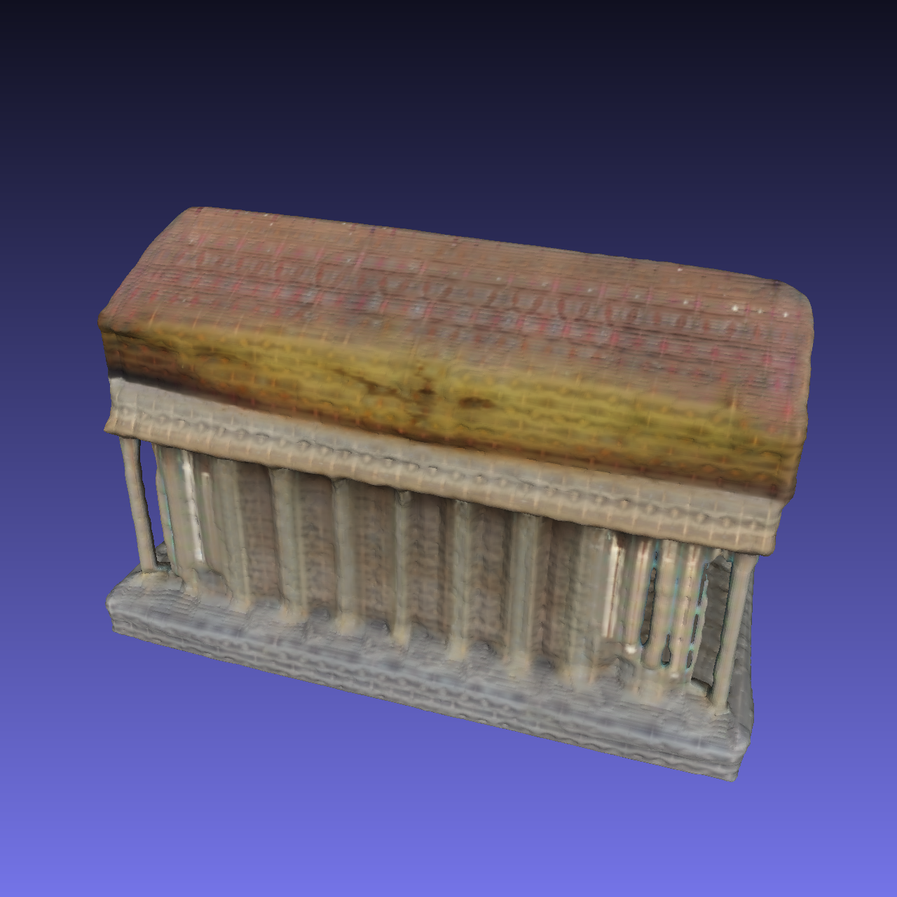
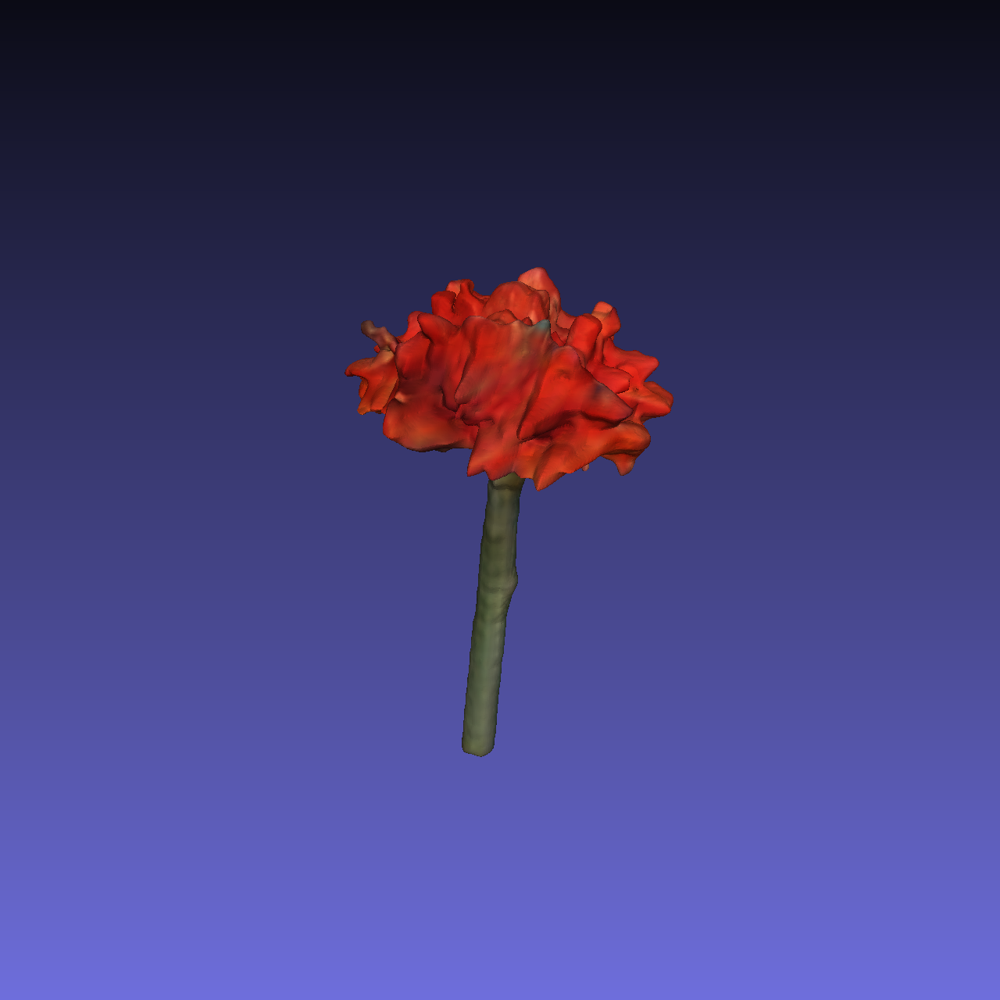
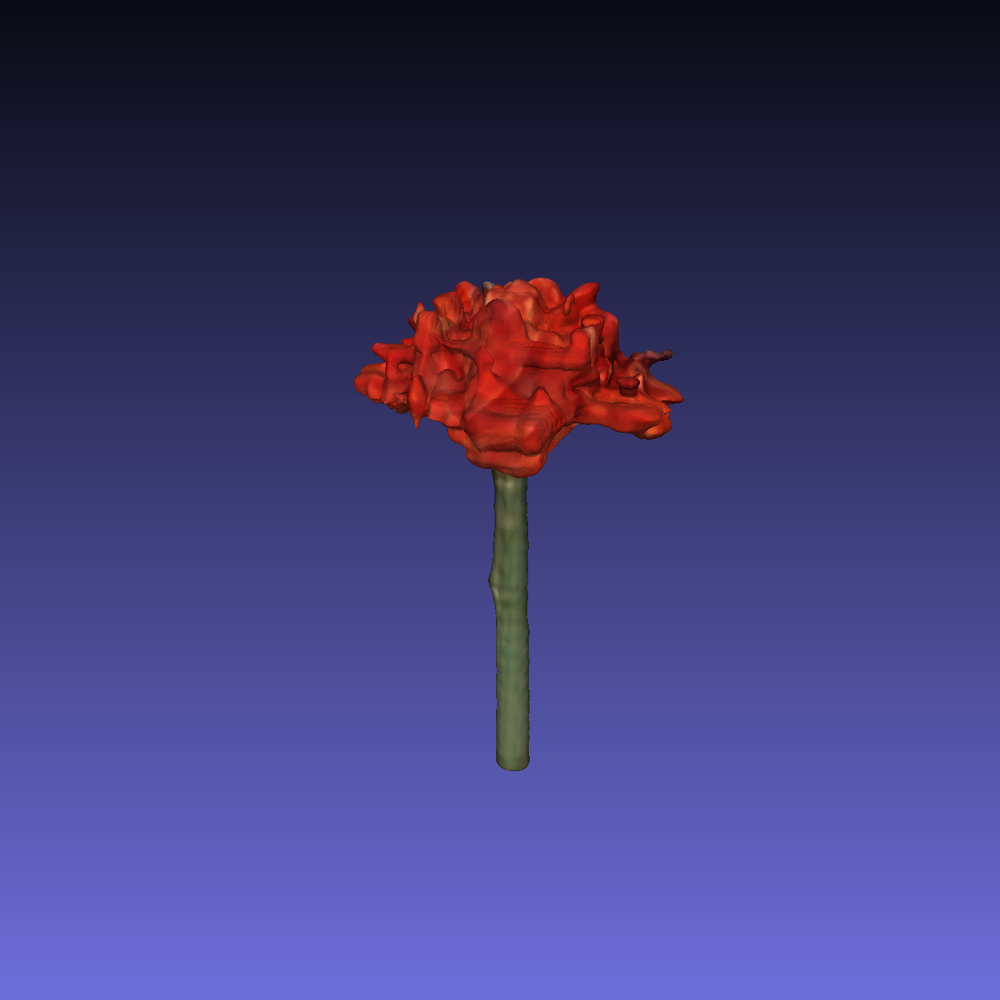

# OpenLRM: Open-Source Large Reconstruction Models

[](LICENSE)
[](LICENSE_WEIGHT)
[](https://arxiv.org/abs/2311.04400)

### Rendered Video


### Mesh Snapshot

<div style="text-align: left">
    
    
    
    
    
    
</div>

## News

- [2023.12.20] Release weights of the base and large models trained on Objaverse.
- [2023.12.20] We release this project OpenLRM, which is an open-source implementation of the paper [LRM](https://arxiv.org/abs/2311.04400).

## Setup

### Installation
```
git clone https://github.com/3DTopia/OpenLRM.git
cd OpenLRM
```

### Environment
```
pip install -r requirements.txt
```

## Quick Start

### Pretrained Models

- Download pretrained model weights from [Hugging Face](https://huggingface.co/zxhezexin/OpenLRM) and put the checkpoints into `.cache` folder.

| Model | Training Data | Layers | Feat. Dim | Trip. Dim. | Render Res. | Link |
| :--- | :--- | :--- | :--- | :--- | :--- | :--- |
| LRM-Base-Obj | Objaverse | 12 | 1024 | 40 | 192 | [HF](https://huggingface.co/zxhezexin/OpenLRM) |
| LRM-Large-Obj | Objaverse | 16 | 1024 | 80 | 384 | [HF](https://huggingface.co/zxhezexin/OpenLRM) |
| LRM-Base | Objaverse + MVImgNet | 12 | 1024 | 40 | 192 | To be released |
| LRM-Large | Objaverse + MVImgNet | 16 | 1024 | 80 | 384 | To be released |

Model cards with additional details can be found in [model_card.md](model_card.md).

### Prepare Images
- We put some sample inputs under `assets/sample_input`, and you can quickly try them.
- Prepare RGBA images or RGB images with white background (with the help of some background removal tools).

### Inference
- Run the inference script to get 3D assets.
- You may specify which form of output to generate by setting the flags `--export_video` and `--export_mesh`.

    ```
    # Example usage
    python -m lrm.inferrer --model_name lrm-small-obj-v1 --source_image ./assets/sample_input/building.png --export_video --export_mesh
    ```

## Training
To be released soon.

## Acknowledgement

- We thank the authors of the [original paper](https://arxiv.org/abs/2311.04400) for their great work! Special thanks to Kai Zhang and Yicong Hong for assistance during the reproduction.
- This project is supported by Shanghai AI Lab by providing the computing resources.
- This project is advised by Ziwei Liu and Jiaya Jia.

## Citation

If you find this work useful for your research, please consider citing:
```
@article{hong2023lrm,
  title={Lrm: Large reconstruction model for single image to 3d},
  author={Hong, Yicong and Zhang, Kai and Gu, Jiuxiang and Bi, Sai and Zhou, Yang and Liu, Difan and Liu, Feng and Sunkavalli, Kalyan and Bui, Trung and Tan, Hao},
  journal={arXiv preprint arXiv:2311.04400},
  year={2023}
}
```

```
@misc{openlrm,
  title = {OpenLRM: Open-Source Large Reconstruction Models},
  author = {Zexin He and Tengfei Wang},
  year = {2023},
  howpublished = {\url{https://github.com/3DTopia/OpenLRM}},
}
```

## License

- OpenLRM as a whole is licensed under the [Apache License, Version 2.0](LICENSE), while certain components are covered by [NVIDIA's proprietary license](LICENSE_NVIDIA). Users are responsible for complying with the respective licensing terms of each component.
- Model weights are licensed under the [Creative Commons Attribution-NonCommercial 4.0 International License](LICENSE_WEIGHT). They are provided for research purposes only, and CANNOT be used commercially.
